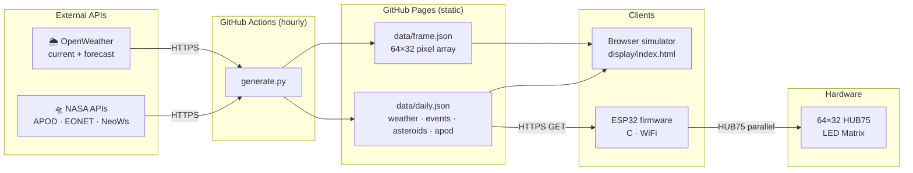

# orrery — System Architecture

End-to-end data pipeline: NASA and weather APIs are fetched hourly by GitHub Actions, committed as static JSON to the repo, then consumed by both the browser simulator and the ESP32 firmware.

