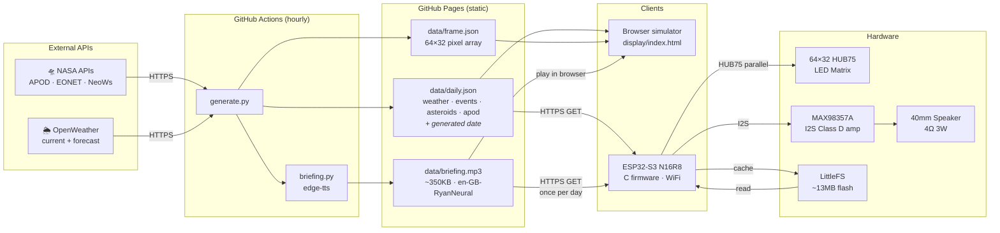

# orrery — System Architecture

End-to-end data pipeline: NASA and weather APIs are fetched hourly by GitHub Actions, committed as static files to the repo, then consumed by both the browser simulator and the ESP32 firmware.

## Components

| Block | What it does |
|-------|-------------|
| **NASA APIs** | Three public endpoints: APOD (daily astronomy photo + caption), EONET v3 (active Earth events with coordinates), NeoWs (near-Earth asteroids within 7 days). Free tier, API key required. |
| **OpenWeather** | Provides current conditions (temp, humidity, wind, icon code) and a 3-hour forecast for the configured location. Free tier covers both endpoints. |
| **generate.py** | Standalone Python script — no Flask, no server. Calls all API functions, wraps errors safely, then writes static files to `data/`. Includes a `generated` date field in `daily.json` for firmware cache invalidation. |
| **briefing.py** | Builds a ~90-second English briefing script from `daily.json` (date, weather, moon phase, APOD, asteroids, Earth events) and synthesises it to MP3 using `edge-tts` (`en-GB-RyanNeural`). Free — no API key required. |
| **GitHub Actions** | Scheduled runner (hourly during dev, every 6h in production). Checks out the repo, runs `generate.py` (which calls `briefing.py`) with API keys from repository secrets, then commits and pushes the updated `data/` files back to `main`. |
| **data/daily.json** | Static file served by GitHub Pages. Contains APOD, weather, forecast, EONET events, asteroid approaches, and a `generated` date string used by firmware to detect when a new briefing MP3 should be downloaded. |
| **data/frame.json** | Pre-processed APOD image as a flat array of 2048 `[r,g,b]` pixels (64×32). Cropped to 2:1, resized with LANCZOS, contrast/color boosted for LED rendering. |
| **data/briefing.mp3** | Daily spoken briefing (~350KB). Generated by `edge-tts` in GitHub Actions. Served statically from GitHub Pages; downloaded once per day by the firmware. |
| **Browser simulator** | Pure HTML5 Canvas app. Fetches JSON and MP3 from GitHub Pages, renders a pixel-accurate 64×32 LED matrix with glow effects and scene cycling. Radio scene plays the briefing with an oscilloscope waveform animation. |
| **ESP32-S3 N16R8** | 16MB flash, 8MB Octal PSRAM. Connects to WiFi, fetches `daily.json`, compares `generated` date against NVS cache key, downloads `briefing.mp3` only when the date changes, then drives the LED panel and audio output. |
| **LittleFS (~13MB)** | Filesystem partition in ESP32 flash. Stores `briefing.mp3` between daily downloads. Eliminates streaming risk — audio plays from local flash, not live network. |
| **64×32 HUB75 LED Matrix** | Physical display panel. 2048 RGB LEDs in a 64×32 grid, driven via 13-pin HUB75E connector (6 data, 4 address, 3 control). |
| **MAX98357A** | Filterless Class D I2S amplifier. Converts the ESP32's I2S digital audio directly to speaker drive — no separate DAC needed. 3W into 4Ω. |
| **40mm Speaker** | 4Ω 3W full-range driver. Adequate for voice-frequency content (300Hz–3kHz); response below 200Hz is limited but irrelevant for speech. |
