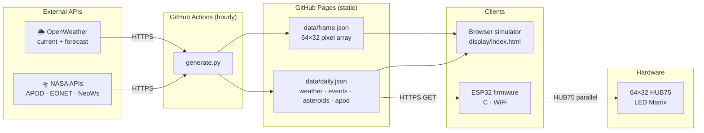

# orrery — System Architecture

End-to-end data pipeline: NASA and weather APIs are fetched hourly by GitHub Actions, committed as static JSON to the repo, then consumed by both the browser simulator and the ESP32 firmware.

## Components

| Block | What it does |
|-------|-------------|
| **NASA APIs** | Three public endpoints: APOD (daily astronomy photo + caption), EONET v3 (active Earth events with coordinates), NeoWs (near-Earth asteroids within 7 days). Free tier, API key required. |
| **OpenWeather** | Provides current conditions (temp, humidity, wind, icon code) and a 3-hour forecast for the configured location. Free tier covers both endpoints. |
| **generate.py** | Standalone Python script — no Flask, no server. Calls all five API functions, wraps errors safely so one failure doesn't abort the run, then writes two JSON files to `data/`. Runs inside GitHub Actions on a cron. |
| **GitHub Actions** | Scheduled runner (hourly during dev, every 6h in production). Checks out the repo, runs `generate.py` with API keys from repository secrets, then commits and pushes the updated `data/` files back to `main`. |
| **data/daily.json** | Single static file served by GitHub Pages. Contains today's APOD title + explanation, current weather, tomorrow's forecast, EONET events list, and asteroid close-approach list. Updated every hour. |
| **data/frame.json** | Pre-processed APOD image as a flat array of 2048 `[r,g,b]` pixels (64×32). Cropped to 2:1, resized with LANCZOS, contrast/color boosted for LED rendering. Updated daily with the APOD. |
| **Browser simulator** | Pure HTML5 Canvas app. Fetches the two JSON files from GitHub Pages, renders a pixel-accurate 64×32 LED matrix with glow effects and scene cycling. Used for development — no hardware required. |
| **ESP32 firmware** | C firmware (in development). Connects to WiFi, fetches `daily.json` over HTTPS, parses JSON, and drives the LED panel via the HUB75 parallel interface. Bluetooth for first-time WiFi provisioning. |
| **64×32 HUB75 LED Matrix** | Physical display panel. 2048 RGB LEDs arranged in a 64-wide × 32-tall grid. Driven via a 13-pin HUB75E connector: 6 color data lines, 5 row-address lines, clock, latch, and output-enable. |
