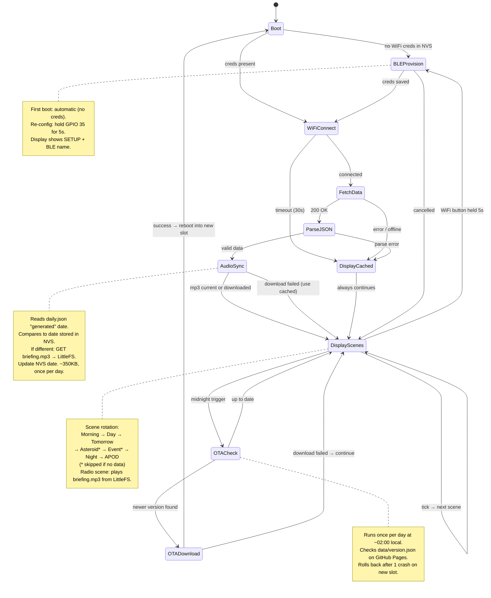

# orrery — Firmware Design

## State machine

Scenes marked `*` are conditional — skipped when no relevant data is available,
mirroring the browser simulator logic.



---

## Infrastructure decisions

| Concern | Decision | Notes |
|---------|----------|-------|
| **Initial flashing** | UF2 drag-and-drop | Device appears as USB drive; no terminal needed for recipients |
| **Provisioning — first boot** | Auto if NVS has no credentials | No button press needed out of the box |
| **Provisioning — re-config** | Hold GPIO 35 (WiFi button) for 5s | Works during normal display operation |
| **Provisioning protocol** | ESP-IDF `wifi_provisioning` over BLE | Espressif phone app or custom app; credentials written to NVS |
| **Display during provisioning** | LED matrix shows `SETUP` + device BLE name | Future: QR code for pairing |
| **OTA check schedule** | Once per day at ~02:00 local time | Low-traffic window; uses `esp_timer` or SNTP-synced RTC |
| **OTA manifest** | `data/version.json` on GitHub Pages | Same host as `daily.json`; no separate server needed |
| **OTA binary host** | `data/firmware.bin` on GitHub Pages | Same-origin as the manifest — no redirects, no signed-URL expiry. GH release assets 302 to a signed URL on a different host, which `esp_https_ota` handles poorly. |
| **OTA rollback** | After 1 crash on new slot | ESP-IDF `esp_ota_mark_app_invalid_rollback_and_reboot()` |
| **CI trigger** | Git tag push (e.g. `v1.2.0`) | Separate workflow from data-fetch; produces `firmware.bin` |
| **Credentials storage** | ESP-IDF NVS (non-volatile storage) | Survives firmware updates; encrypted NVS optional later |

---

## Partition table

Dual-OTA layout on the ESP32-S3 N16R8 (16MB flash). OTA slots are sized at
1.5MB each to leave headroom for future growth; the remaining ~13MB is a
LittleFS filesystem partition used to cache audio assets.

```
# Name       Type  SubType   Offset    Size        Notes
nvs          data  nvs       0x9000    0x6000      WiFi creds, config, OTA state (24KB)
otadata      data  ota       0xf000    0x2000      Tracks which OTA slot is active (8KB)
phy_init     data  phy       0x11000   0x1000      RF calibration data (4KB)
ota_0        app   ota_0     0x20000   0x180000    Slot A — 1.5MB
ota_1        app   ota_1     0x1A0000  0x180000    Slot B — 1.5MB
storage      data  spiffs    0x320000  0xCE0000    LittleFS — ~13MB (audio assets)
```

Memory budget (estimated):
| Region | Size | Contents |
|--------|------|----------|
| OTA slot | 1.5MB | ESP-IDF + wifi_provisioning + OTA + HUB75 driver + JSON + scene logic |
| LittleFS | ~13MB | `briefing.mp3` (~350KB), `frame.bin` (future), room to grow |

**Slot switching:**
- `ota_0` is the factory slot (first flash via UF2)
- OTA downloads new firmware into `ota_1`, validates, reboots
- `otadata` partition records which slot to boot from
- If `ota_1` crashes on first boot → bootloader rolls back to `ota_0`

---

## Audio storage

The daily briefing MP3 is downloaded once and cached in the LittleFS
`storage` partition. It is never streamed live — playback reads from flash.

**Flow:**
1. After a successful `FetchData`, firmware reads the `generated` field from
   `daily.json` (e.g. `"2026-04-06"`) and compares it to the date stored in NVS.
2. If the date differs (new day), firmware downloads `data/briefing.mp3` from
   GitHub Pages and writes it to `/storage/briefing.mp3` on LittleFS.
3. NVS is updated with the new date so the file is not re-downloaded until
   tomorrow.
4. On button press (or scheduled morning play), the firmware reads the cached
   MP3 from LittleFS and streams it to the MAX98357A over I2S.

**Why this approach:**
- No mid-sentence network dropout risk
- Instant start (no buffer fill delay)
- Works while WiFi is reconnecting or momentarily offline
- ~350KB is well within the 13MB partition

**Cache invalidation key in `daily.json`:**
```json
{
  "generated": "2026-04-06",
  ...
}
```

---

## OTA version manifest

A tiny JSON file committed to the repo alongside `daily.json` and served
from the same GitHub Pages host, plus the firmware binary itself:

```json
{
  "version": "1.0.1",
  "url": "https://art-mon.github.io/orrery/data/firmware.bin",
  "notes": "First OTA-delivered release."
}
```

Both files live under `data/` and get served by GH Pages, so the client
opens exactly one TLS connection — to the same host it already uses for
`daily.json` — with no cross-origin redirects.

The running firmware's version comes from `PROJECT_VER` in the top-level
`firmware/CMakeLists.txt`, which ESP-IDF stamps into the app descriptor
(`esp_app_get_description()->version`). The OTA client parses both strings
as `MAJOR.MINOR.PATCH`; any non-numeric suffix is ignored, so `1.2.0-rc1`
compares equal to `1.2.0`.

If the manifest version is strictly greater, `esp_https_ota` writes the
binary at `url` directly into the inactive OTA slot and the device reboots.

Fields currently read: `version`, `url`. `notes` and any future fields
(release date, min flash size, changelog) are ignored by the client but
useful for humans reading the manifest.

---

## Releasing a new firmware version — manual runbook

Until the CI workflow lands, cutting a release is a four-step manual flow.
Do it once end-to-end to prove the client works before automating.

1. **Bump `PROJECT_VER`** in `firmware/CMakeLists.txt` (e.g. `1.0.0` → `1.0.1`).
2. **Build**: `cd firmware && idf.py build`. Confirm the resulting
   `build/orrery.bin` is under 1.5 MB (`ota_0`/`ota_1` slot size) and check
   the reported `X% free` line — that's your headroom.
3. **Publish binary + manifest**: copy the build to Pages and update
   `version.json` in one commit:
   ```bash
   cp firmware/build/orrery.bin data/firmware.bin
   # edit data/version.json — bump "version"; url stays the same
   git add data/firmware.bin data/version.json
   git commit -m "ota: release vX.Y.Z"
   git push
   ```
   Tagging (`git tag vX.Y.Z && git push origin vX.Y.Z`) is optional but
   recommended so `git log` has a semver anchor per release; no GH release
   needs to be cut since the binary lives on Pages.
4. **Wait for GH Pages to redeploy** — usually under a minute after push.
   Verify with `curl -sSL https://art-mon.github.io/orrery/data/version.json`.
5. **Watch the device pick it up.** During bring-up the OTA task uses a
   **test cadence** — first check ~60s after boot, then every 30 min — so
   a fresh flash validates end-to-end within minutes and a release lands
   on the bench in the same session. Both intervals are defined at the
   top of [firmware/main/ota.c](../firmware/main/ota.c) and should be
   raised (or replaced with the 02:00-local schedule) before shipping.
   In the serial log you should see:
   ```
   I (…) ota: running version: 1.0.0
   I (…) ota: manifest version: 1.0.1 url: https://…
   I (…) ota: newer version available — downloading
   I (…) ota: OTA success — rebooting into new slot
   ```
   After the reboot, the app comes up on the new slot as `PENDING_VERIFY`.
   Once wifi connects and `daily_fetch` returns non-empty, `app_main` calls
   `ota_mark_running_valid()`, which cancels the pending rollback. If either
   step fails, the next reset drops back to the previous slot automatically
   (bootloader-enforced via `CONFIG_BOOTLOADER_APP_ROLLBACK_ENABLE`).

**Deliberate rollback test** (do this once): publish a version that fails
its health check — e.g. temporarily point `DAILY_JSON_URL` at a 404. The
device should update, boot the broken slot, fail to fetch, and on the next
reset boot back into the previous slot without your intervention.

---

## CI — firmware build workflow (future)

Once the manual runbook has been proven end-to-end, wrap it in a workflow
triggered by a git tag (`v*`), separate from the hourly data-fetch workflow.

```
on: push tags: ["v*"]

steps:
  1. Checkout repo
  2. Install ESP-IDF (idf-component-manager cache)
  3. Parse the tag → set PROJECT_VER
  4. idf.py build
  5. Copy firmware/build/orrery.bin to data/firmware.bin
  6. Update data/version.json with the new tag
  7. Commit both files back to main [skip ci]
```

Releasing a new firmware version then reduces to:
```bash
git tag v1.2.0 && git push origin v1.2.0
```
Devices pick it up on their next OTA check.
