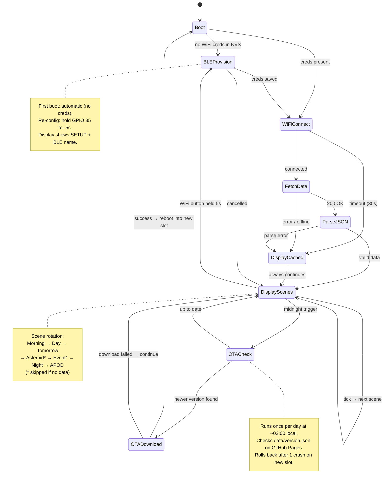

# orrery — Firmware Design

## State machine

Scenes marked `*` are conditional — skipped when no relevant data is available,
mirroring the browser simulator logic.



---

## Infrastructure decisions

| Concern | Decision | Notes |
|---------|----------|-------|
| **Initial flashing** | UF2 drag-and-drop | Device appears as USB drive; no terminal needed for recipients |
| **Provisioning — first boot** | Auto if NVS has no credentials | No button press needed out of the box |
| **Provisioning — re-config** | Hold GPIO 35 (WiFi button) for 5s | Works during normal display operation |
| **Provisioning protocol** | ESP-IDF `wifi_provisioning` over BLE | Espressif phone app or custom app; credentials written to NVS |
| **Display during provisioning** | LED matrix shows `SETUP` + device BLE name | Future: QR code for pairing |
| **OTA check schedule** | Once per day at ~02:00 local time | Low-traffic window; uses `esp_timer` or SNTP-synced RTC |
| **OTA manifest** | `data/version.json` on GitHub Pages | Same host as `daily.json`; no separate server needed |
| **OTA binary host** | GitHub Releases asset (`.bin`) | Tagged release triggers CI build |
| **OTA rollback** | After 1 crash on new slot | ESP-IDF `esp_ota_mark_app_invalid_rollback_and_reboot()` |
| **CI trigger** | Git tag push (e.g. `v1.2.0`) | Separate workflow from data-fetch; produces `firmware.bin` |
| **Credentials storage** | ESP-IDF NVS (non-volatile storage) | Survives firmware updates; encrypted NVS optional later |

---

## Partition table

Standard dual-OTA layout. Leaves room for the UF2 bootloader and NVS config.

```
# Name       Type  SubType   Offset    Size      Notes
nvs          data  nvs       0x9000    0x6000    WiFi creds, config, OTA state
otadata      data  ota       0xf000    0x2000    Tracks which OTA slot is active
phy_init     data  phy       0x11000   0x1000    RF calibration data
ota_0        app   ota_0     0x20000   0xC0000   Slot A — 768KB
ota_1        app   ota_1     0xE0000   0xC0000   Slot B — 768KB
```

768KB per slot is comfortable for the firmware image (estimated 300–450KB for
ESP-IDF + wifi_provisioning + OTA + HUB75 driver + JSON parser + scene logic).
If we add audio or more complex assets, bump each slot to 0x100000 (1MB) and
use the N16R8 module (16MB flash) instead of N8R2.

**Slot switching:**
- `ota_0` is the factory slot (first flash via UF2)
- OTA downloads new firmware into `ota_1`, validates, reboots
- `otadata` partition records which slot to boot from
- If `ota_1` crashes on first boot → bootloader rolls back to `ota_0`

---

## OTA version manifest

A tiny JSON file committed to the repo alongside `daily.json`:

```json
{
  "version": "1.0.0",
  "url": "https://github.com/art-mon/orrery/releases/download/v1.0.0/firmware.bin",
  "min_flash_kb": 768,
  "notes": "Initial release"
}
```

Firmware compares the `version` string against its own build-time version.
If newer, downloads from `url` directly into the inactive OTA slot.

---

## CI — firmware build workflow (future)

Triggered by a git tag (`v*`). Separate from the hourly data-fetch workflow.

```
on: push tags: ["v*"]

steps:
  1. Checkout repo
  2. Install ESP-IDF (idf-component-manager cache)
  3. idf.py build
  4. Upload firmware/build/orrery.bin as GitHub Release asset
  5. Update data/version.json with new tag + asset URL
  6. Commit version.json back to main [skip ci]
```

This means releasing a new firmware version is just:
```bash
git tag v1.2.0 && git push origin v1.2.0
```
Devices pick it up overnight.
