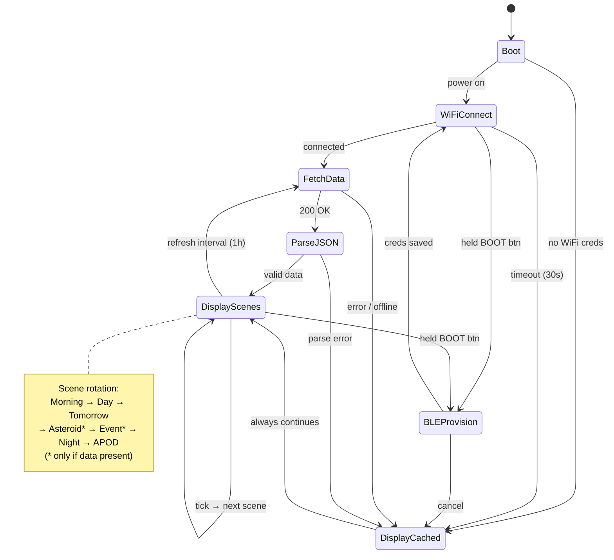

# orrery — Firmware State Machine

Firmware state machine for the ESP32. Scenes marked with * are conditional — they are skipped when no relevant data is available (mirrors the browser simulator logic).

