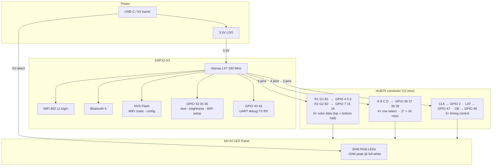

# orrery — Hardware Block Diagram

ESP32-S3 driving a 64×32 HUB75 LED panel. The panel uses 1:16 multiplexed scanning
(top and bottom 16 rows driven simultaneously via R1/G1/B1 and R2/G2/B2), so only
4 address lines are needed — not 5. Total GPIO usage is 18 pins out of 45 available.

## Pin assignment table

| Signal | GPIO | Notes |
|--------|------|-------|
| R1     | 4    | Top-half red |
| G1     | 5    | Top-half green |
| B1     | 6    | Top-half blue |
| R2     | 7    | Bottom-half red |
| G2     | 15   | Bottom-half green |
| B2     | 16   | Bottom-half blue |
| A      | 36   | Row address bit 0 |
| B      | 37   | Row address bit 1 |
| C      | 38   | Row address bit 2 |
| D      | 39   | Row address bit 3 |
| CLK    | 2    | Shift register clock |
| LAT    | 47   | Latch — transfers shift register to outputs |
| OE     | 48   | Output enable (active low — controls brightness via PWM) |
| BTN_NEXT  | 33 | Scene advance |
| BTN_BRITE | 34 | Brightness cycle |
| BTN_WIFI  | 35 | Hold to enter BLE provisioning |
| UART TX   | 43 | Debug serial (S3 default) |
| UART RX   | 44 | Debug serial (S3 default) |

**Avoided GPIOs on ESP32-S3:**
- GPIO 0: strapping pin (boot mode — leave floating or pull high)
- GPIO 19/20: USB D−/D+ (needed if using USB-OTG for flashing)
- GPIO 26–32: internal flash / PSRAM bus on Octal PSRAM variants

Pin assignments match the defaults used by the
[ESP32-HUB75-MatrixPanel-I2S-DMA](https://github.com/mrfaptastic/ESP32-HUB75-MatrixPanel-I2S-DMA)
library, which drives HUB75 via the I2S DMA peripheral — zero CPU overhead during refresh.
