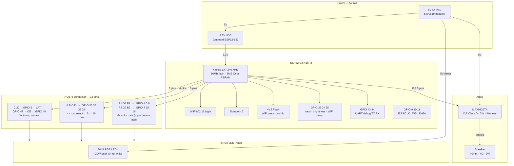

# orrery — Hardware Block Diagram

ESP32-S3 driving a 64×32 HUB75 LED panel and a MAX98357A I2S audio amplifier.
The panel uses 1:16 multiplexed scanning (top and bottom 16 rows driven simultaneously),
so only 4 address lines are needed. Total GPIO usage is 22 pins out of 45 available.

---

## Pin assignment table

### HUB75 — LED matrix (13 pins)

| Signal | GPIO | Notes |
|--------|------|-------|
| R1     | 4    | Top-half red |
| G1     | 5    | Top-half green |
| B1     | 6    | Top-half blue |
| R2     | 7    | Bottom-half red |
| G2     | 15   | Bottom-half green |
| B2     | 16   | Bottom-half blue |
| A      | 36   | Row address bit 0 |
| B      | 37   | Row address bit 1 |
| C      | 38   | Row address bit 2 |
| D      | 39   | Row address bit 3 |
| CLK    | 2    | Shift register clock |
| LAT    | 47   | Latch — transfers shift register to outputs |
| OE     | 48   | Output enable (active low — PWM controls brightness) |

### Audio — MAX98357A (3 pins)

| Signal | GPIO | Notes |
|--------|------|-------|
| BCLK   | 9    | I2S bit clock |
| WS     | 10   | I2S word select (LRCLK) |
| DATA   | 11   | I2S serial data |
| SD     | —    | Tie to 3.3V for always-on (or GPIO for mute control) |

### User interface & debug (6 pins)

| Signal | GPIO | Notes |
|--------|------|-------|
| BTN_NEXT  | 33 | Next scene |
| BTN_BRITE | 34 | Brightness cycle |
| BTN_WIFI  | 35 | Hold 5s → BLE provisioning |
| UART TX   | 43 | Debug serial (S3 default) |
| UART RX   | 44 | Debug serial (S3 default) |

**Total used: 22 of 45 GPIO · 23 free for future use**

---

## Avoided GPIOs on ESP32-S3

| GPIO | Reason to avoid |
|------|----------------|
| 0 | Strapping pin — boot mode selection |
| 19, 20 | USB D−/D+ — needed for USB-OTG flashing |
| 26–32 | Octal PSRAM bus (N16R8 variant) — internally consumed |
| 45, 46 | Strapping pins |

---

## Audio driver — MAX98357A

The MAX98357A accepts I2S digital audio from the ESP32-S3 and drives the speaker
directly — no separate DAC, no external filter, no amplifier stage needed.

- **Input:** I2S (BCLK, WS, DATA) — 3 GPIO pins
- **Output:** Class D PWM → speaker (internal LC filter)
- **Power:** 5V from the main rail (same as panel)
- **Output power:** 3W into 4Ω @ 5V
- **Gain:** set by SD pin — float = 12dB, GND = 15dB, 3.3V = 9dB
- **Mono:** single chip drives one speaker, which is sufficient for voice and tones

Pin assignments match the defaults used by the
[ESP32-HUB75-MatrixPanel-I2S-DMA](https://github.com/mrfaptastic/ESP32-HUB75-MatrixPanel-I2S-DMA)
library for the HUB75 side, and ESP-IDF's I2S driver for the audio side.
Both use DMA — neither blocks the CPU during operation.
