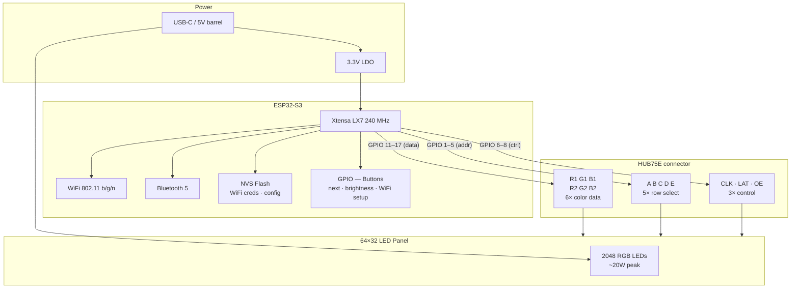

# orrery — Hardware Block Diagram

Hardware block diagram. GPIO pin numbers are illustrative — final mapping depends on PCB layout and HUB75 library pin configuration.

```mermaid
graph TD
    subgraph psu [" Power "]
        USB["USB-C / 5V barrel"]
        REG["3.3V LDO"]
    end

    subgraph esp [" ESP32-S3 "]
        CPU["Xtensa LX7 240 MHz"]
        WIFI["WiFi 802.11 b/g/n"]
        BT["Bluetooth 5"]
        NVRAM["NVS Flash<br/>WiFi creds · config"]
        BTN["GPIO — Buttons<br/>next · brightness · WiFi setup"]
    end

    subgraph hub75 [" HUB75E connector "]
        RGB["R1 G1 B1<br/>R2 G2 B2<br/>6× color data"]
        ADDR["A B C D E<br/>5× row select"]
        CTRL["CLK · LAT · OE<br/>3× control"]
    end

    subgraph panel [" 64×32 LED Panel "]
        LEDS["2048 RGB LEDs<br/>~20W peak"]
    end

    USB --> REG
    USB --> LEDS
    REG --> CPU
    CPU --> WIFI
    CPU --> BT
    CPU --> NVRAM
    CPU --> BTN
    CPU -->|"GPIO 11–17 (data)"| RGB
    CPU -->|"GPIO 1–5  (addr)"| ADDR
    CPU -->|"GPIO 6–8  (ctrl)"| CTRL
    RGB  --> panel
    ADDR --> panel
    CTRL --> panel
```
