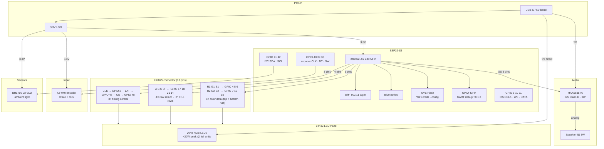

# orrery — Hardware Block Diagram

ESP32-S3 driving a 64×32 HUB75 LED panel and a MAX98357A I2S amplifier, plus a KY-040 rotary encoder for user input and a BH1750 ambient light sensor on I2C. The panel uses 1:16 multiplexed scanning (top and bottom 16 rows driven simultaneously), so only 4 address lines are needed. Total GPIO usage is 23 pins out of 45 available.

---

## Pin assignment table

### HUB75 — LED matrix (13 pins)

| Signal | GPIO | Notes |
|--------|------|-------|
| R1     | 4    | Top-half red |
| G1     | 5    | Top-half green |
| B1     | 6    | Top-half blue |
| R2     | 7    | Bottom-half red |
| G2     | 15   | Bottom-half green |
| B2     | 16   | Bottom-half blue |
| A      | 17   | Row address bit 0 |
| B      | 18   | Row address bit 1 |
| C      | 21   | Row address bit 2 |
| D      | 14   | Row address bit 3 |
| CLK    | 2    | Shift register clock |
| LAT    | 47   | Latch — transfers shift register to outputs |
| OE     | 48   | Output enable (active low — PWM controls brightness) |

### Audio — MAX98357A (3 pins)

| Signal | GPIO | Notes |
|--------|------|-------|
| BCLK   | 9    | I2S bit clock |
| WS     | 10   | I2S word select (LRCLK) |
| DATA   | 11   | I2S serial data |
| SD     | —    | Tie to 3.3V for always-on (or GPIO for mute control) |

### Rotary encoder — KY-040 (3 pins)

| Signal   | GPIO | Notes |
|----------|------|-------|
| ENC_CLK  | 40   | A channel — module has 10 kΩ pullup on-board |
| ENC_DT   | 39   | B channel — module has 10 kΩ pullup on-board |
| ENC_SW   | 38   | Push button — enable ESP32 internal pullup |
| VCC      | —    | 3.3V (see BH1750 note about the 5V pin) |
| GND      | —    | Common ground |

### Ambient light — BH1750 (GY-302) on I2C (2 pins)

| Signal | GPIO | Notes |
|--------|------|-------|
| SDA    | 41   | I2C0 data — shared bus for future I2C parts |
| SCL    | 42   | I2C0 clock |
| ADDR   | —    | Leave floating → 7-bit address 0x23 |
| VCC    | —    | **3.3V** — the GY-302 accepts 3–5V, but its SDA/SCL pullups tie to the input VCC rail. Powering from 5V would back-feed 5V into the ESP32-S3's 3.3V-only GPIOs. |
| GND    | —    | Common ground |

### Debug (2 pins)

| Signal | GPIO | Notes |
|--------|------|-------|
| UART TX   | 43 | Debug serial (S3 default) |
| UART RX   | 44 | Debug serial (S3 default) |

### Buttons — legacy, currently unusable

The three tactile buttons defined in `firmware/main/pins.h` are on GPIO 33/34/35, which
fall inside the octal-PSRAM range (26-37) on this S3 module and cannot be driven.
The KY-040 covers next/brightness/WiFi-setup through rotate + click + long-press,
so these are candidates for removal.

**Total used: 23 of 45 GPIO · 22 free for future use**

Free pins: 1, 3, 8, 12, 13.

---

## Avoided GPIOs on ESP32-S3

| GPIO | Reason to avoid |
|------|----------------|
| 0 | Strapping pin — boot mode selection |
| 19, 20 | USB D−/D+ — needed for USB-OTG flashing |
| 22–25 | Not exposed on ESP32-S3 (gap in the GPIO numbering) |
| 26–37 | Octal PSRAM bus (N16R8 variant) — internally consumed |
| 45, 46 | Strapping pins |

---

## Input — KY-040 rotary encoder

The KY-040 breakout provides a quadrature rotary encoder plus a momentary push button.
The module has 10 kΩ pull-ups to VCC on the CLK/DT lines, so no external resistors are
needed — the ESP32 sees clean digital edges. The push button switches to GND, so enable
the internal pull-up on `PIN_ENC_SW`.

Both CLK and DT should attach to GPIO interrupts. Debounce in software: the KY-040 has
no on-board R-C filter and the mechanical switch bounces for a few hundred µs.

## Ambient light — BH1750 (GY-302)

A 16-bit ambient light sensor (1–65535 lux) on I2C. The main use is auto-brightness for
the LED panel so the display doesn't scorch retinas in a dark room and doesn't wash out
in daylight.

- **Interface:** I2C, up to 400 kHz. Fits on the same bus as any future I2C devices.
- **Address:** `0x23` with ADDR floating, `0x5C` if ADDR is tied to VCC.
- **Timing:** one-shot high-res mode returns after ~120 ms; suitable for polling once
  per second.
- **Power the module from 3.3V** (see the pin table above for why).

## Audio driver — MAX98357A

The MAX98357A accepts I2S digital audio from the ESP32-S3 and drives the speaker
directly — no separate DAC, no external filter, no amplifier stage needed.

- **Input:** I2S (BCLK, WS, DATA) — 3 GPIO pins
- **Output:** Class D PWM → speaker (internal LC filter)
- **Power:** 5V from the main rail (same as panel)
- **Output power:** 3W into 4Ω @ 5V
- **Gain:** set by SD pin — float = 12dB, GND = 15dB, 3.3V = 9dB
- **Mono:** single chip drives one speaker, which is sufficient for voice and tones

Pin assignments match the defaults used by the
[ESP32-HUB75-MatrixPanel-I2S-DMA](https://github.com/mrfaptastic/ESP32-HUB75-MatrixPanel-I2S-DMA)
library for the HUB75 side, and ESP-IDF's I2S driver for the audio side.
Both use DMA — neither blocks the CPU during operation.
